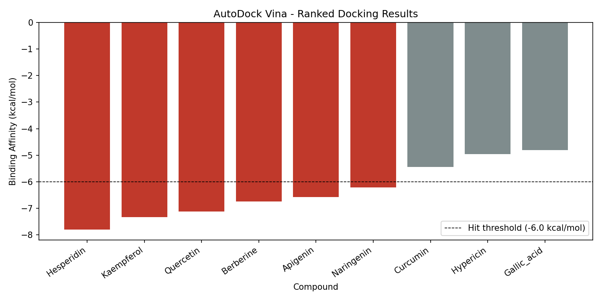

# Vina Docking Pipeline

This automated pipeline is designed to parse, filter and rank the AutoDock Vina docking results obtained from virtual screening.

## Background

Post-processing large-library docking with AutoDock Vina means obtaining binding affinities, checking them against Lipinski's rule of 5, and ordering the hits. Doing this manually across a hundred compounds is tedious, error-prone, and becomes a real bottleneck in the lead discovery phase.

## Implementation

The parseandfilter.py script automates this:

1. Takes docking output from an appropriately formatted CSV file (binding affinities, Lipinski parameters).
2. Uses a pre-computed "Rule of Five flag" to filter out non-drug-like molecules.
3. Sorts the molecules by binding affinity (more negative binding affinity means tighter binding)
4. Flags "hits" to a user-defined binding affinity threshold.
5. Writes out a ranked summary table and a bar chart of binding affinities.

Note: `data/mock_data/compound_library_mock.csv` is only a placeholder *input* list used to demonstrate the pipeline — the compound names are illustrative, but the properties returned when you run the script are real values fetched live from PubChem, not fabricated.

## Technical Stack

| Component | Function |
|---|---|
| Python 3.10+ | Core data processing |
| pandas | Tabular data manipulation and ranking |
| matplotlib | Visualization of binding affinities |

## Usage

Run from the repository root:

```bash
pip install -r requirements.txt

python parse_and_filter.py --input data/mock_data/docking_results.csv --results results/
```

## Mock Data

`data/mock_data/docking_results.csv` is a synthetic dataset generated to
exercise the pipeline end-to-end. The compound names are real natural-product
molecules commonly used in docking-study examples; the binding-affinity
values are fabricated for demonstration purposes and do not correspond to
any actual docking run, published or unpublished.

## File Structure

```
vina-docking-pipeline/
│
├── data/
│   └── mock_data/
│       └── docking_results.csv     # Illustrative docking results for testing
│
├── results/                        # Output folder (generated on execution)
│   ├── ranked_hits.csv
│   └── affinity_chart.png
│
├── parse_and_filter.py             # Main pipeline script
├── .gitignore
├── requirements.txt
└── README.md
```
## Example output

```bash
python parse_and_filter.py --input data/mock_data/docking_results.csv --results results/
```



## Related repositories

- [cadd-fastapi-service](https://github.com/AmirSedaghaati/cadd-fastapi-service) — FastAPI service exposing this pipeline's docking-result parsing as an endpoint
- [pubchem-metabolite-descriptor-fetcher](https://github.com/AmirSedaghaati/pubchem-metabolite-descriptor-fetcher) — batch descriptor retrieval pipeline (Python + R)
